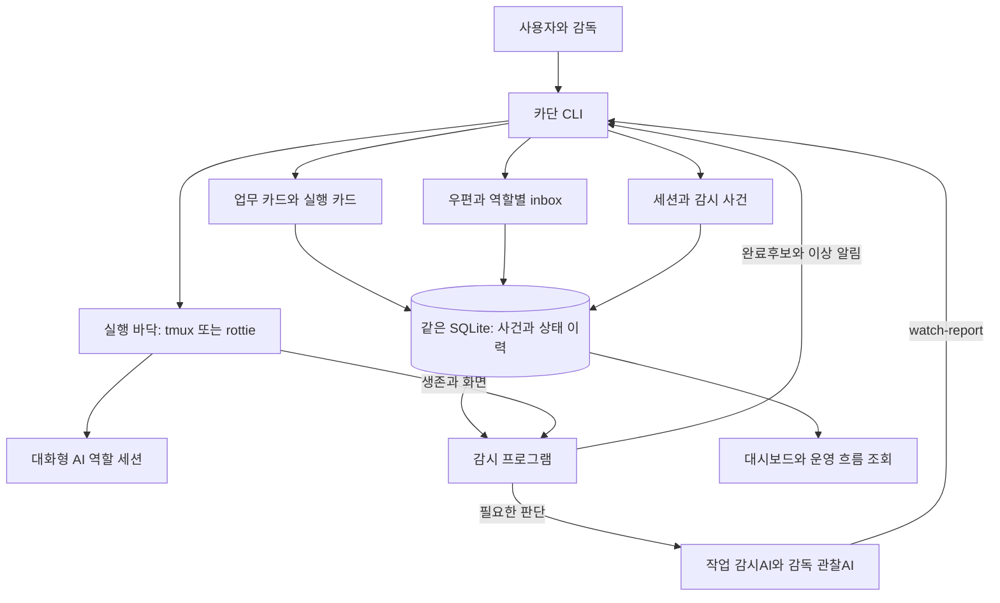
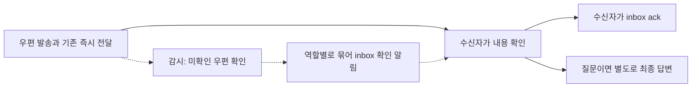

# 카단 구조와 원장 기준

## Why

사용자와 에이전트가 무엇을 맡았는지, 어떤 대화를 확인해야 하는지, 실행이 어디까지 끝났는지를 서로 혼동하지 않고 한 구조에서 확인하게 한다.

이 문서는 구성요소의 관계와 책임을 설명하는 기준 원본이다. 명령·저장 형식은 연결된 주제별 문서를 따른다. 변경 이력·시험 로그는 작업장 기록에 남기고 이 문서는 현재 구조로 갱신한다.

검토 기준: **2026-09-16**, 원장 개편 코드 **`52878c1`**. 아래의 **구현됨**은 해당 코드 기준이며 main 병합·운영 적용을 뜻하지 않는다. **합의·미구현**과 **검토 제안**을 구분한다.

## 한눈에 보는 현재 구조

이 그림은 현재 연결이다. 미확인 우편을 주기적으로 찾아 깨우는 연결은 아직 없다. UI 조회가 읽음·완료를 대신 기록하지도 않는다.

## 각각 무엇을 맡는가

| 개념 | 답하는 질문 | 기준 원본 |
| --- | --- | --- |
| 업무 카드 | 어떤 결과를 누구 책임으로 완성하는가? | 목표·범위·완료 조건·책임 감독·연결 실행을 가진 업무 상태 |
| 실행 카드 | 그 결과를 위해 지금 누구에게 무엇을 맡겼는가? | 구현·검수·수정 등 실행의 범위·담당·진행 상태 |
| 공통 실행 사건 원장 | 언제 발령했고 누가 실행을 끝냈는가? | `tasks/events.jsonl`의 plan·dispatch·done |
| 우편 | 누구에게 무슨 말을 했고 읽음·답변은 어떤 상태인가? | `mail/events.jsonl`과 본문 파일 |
| 역할별 우편함(inbox) | 내가 받은 편지·보낸 편지·답할 질문은 무엇인가? | 우편 원장의 역할별 조회. 역할마다 새 DB를 만들지 않음 |
| 시스템 사건 원장 | 어떤 세션이 시작·종료됐고 감시가 무엇을 했는가? | `system/events.jsonl` |
| 실행 바닥 | 어느 터미널에 입력하고 화면을 읽는가? | tmux 또는 rottie의 실제 세션과 PID |

**공통 실행 원장은 실행 카드에 연결되는 사건 이력이다.** 별도의 업무 관리 체계를 하나 더 만드는 것이 아니다. 카드 상태 이력은 약속과 진행을, 공통 사건은 발령·실행 종료를 맡는다. 카드에 연결된 일반 질문도 새 실행은 아니다.

카드는 할 일의 계약이고 우편은 전달 수단이다. 작업 지시는 `send --task`로 둘을 연결한다. 질문·답장은 카드 없이 보낼 수 있고, 기존 일에 관한 대화에는 `--work`·`--execution`을 붙인다. 단순 직접 작업까지 카드를 만들지는 않는다.

## 같은 저장소 안의 원장

| 영역 | 저장 스트림 | 범위 |
| --- | --- | --- |
| 작업 | `works/.../events.jsonl`, `cards/.../events.jsonl`, `tasks/events.jsonl` | 기존 업무·카드 상태와 공통 실행 사건 |
| 우편 | `mail/events.jsonl` | send·mail-read·mail-cancel. 질문과 답장은 send의 연결 정보 |
| 시스템 | `system/events.jsonl` | start·stop·alert·watch 등 공통 운영 사건 |
| 기존 전용 상태 | decision·brief·automatic-review 등의 기존 저장 경로 | 원장 분리만으로 합치거나 옮기지 않음 |

SQLite에서는 위 이름이 같은 DB 안의 스트림 주소다. JSONL 호환 방식에서는 파일 경로다. 원장은 뒤에만 추가하며, 과거 `ledger.jsonl` 이력은 그대로 보존한다. 본문은 `mail/<지문>.txt`에 둔다.

우편과 작업을 연결하는 키는 다음과 같다.

- `workKey`: 전체 업무 주소.
- `executionKey`: 관련 실행 카드 주소. 이것만으로 발령을 뜻하지 않는다.
- `taskId`: 실행 발령·DONE을 연결하는 식별자. 짧은 ID와 정식 주소는 기존 [카드 주소 규칙](task-identity.md)을 따른다.
- `mailId`: 개별 우편 ID. `replyTo`는 답장 대상, `dispatchId`는 발령 우편과 실행 사건의 연결이다.
- `completionTaskId`: 자동 결과 우편이 설명하는 실행. 그 우편 자체를 발령으로 만들지 않는다.

`readLedger`는 기존 소비자를 위한 통합 호환 조회다. 발령을 send 형태로 한 번 보여주므로, 새 감시 코드가 모든 send를 터미널 입력이나 새 작업으로 해석하면 안 된다. 저장 원자성·조회 순서·구형 작성자 혼용 제한은 [원장 계약](mail-task-ledgers.md)과 [저장 운영](sqlite-storage.md)을 따른다.

## 서로 대신할 수 없는 상태

| 사실 | 누가 기록하는가 | 뜻하지 않는 것 |
| --- | --- | --- |
| 저장 | CLI와 저장 모듈 | 터미널 전달·읽음 |
| 터미널 전달 | 기존 send와 바닥의 전달 영수증 | AI가 읽음·착수·완료 |
| 읽음 확인(ack) | 내용을 확인한 수신 에이전트가 명시적으로 실행 | 승인·답변 완료·작업 완료 |
| 최종 답변(reply-final) | 원본 수신자의 명시적 답장 | 자동 읽음·사용자 승인·DONE |
| 실행 종료(done) | 마커를 확인한 wait/자동 전달 또는 확인한 감독의 CLI | 검수 합격·전체 업무 완료 |
| 업무 완료(work complete) | 전체 결과와 근거를 확인한 책임 감독 | 개별 DONE만으로 자동 종료 |

`read`, 웹 본문 펼치기, 전송 성공, 답장, DONE에서 읽음을 추정하지 않는다. 읽음은 별도 `mail-read` 사건이다. 질문의 답변 대기는 `waiting → answered` 또는 `waiting → cancelled`이며 ack·중간 답장으로 닫지 않는다.

현재 CLI는 수신자 또는 사용자의 명시적 ack를 허용한다. **에이전트 운영의 기본은 각 수신자가 자기 우편을 확인하는 것**이며, 감시·발신자가 대리 ack하지 않는다. 사용자 수동 처리 예외는 기존 기능이다. `by`·`KADAN_ROLE`은 스스로 밝힌 역할이므로 인증된 신분으로 확대 해석하지 않는다.

## 읽음과 깨움: 합의·미구현 범위

**합의:** 일반 우편은 기존처럼 즉시 터미널에 넣는다. 감시는 별도 배달 확인 서비스를 만들지 않고, 기존 순회에서 오래 남은 미확인 우편을 확인한다. 읽음은 수신 에이전트가 직접 체크한다.

목표 흐름은 아래와 같다. 순서도는 운영 정책이며 모든 단계가 구현됐다는 뜻은 아니다.

- **이미 구현됨:** 명시적 `inbox ack`, 답변 상태 분리, 일반 send의 터미널 전달. `--mailbox`와 자동 결과 우편은 저장 전용이다.
- **연결 필요:** 일반 수신 메시지에도 우편 ID와 ack 안내를 제공한다. 현재 질문은 ID와 최종 답변 안내가 붙지만, 모든 메시지의 ack 안내는 아직 없다. 원문 보존 `--raw`는 본문을 몰래 바꾸지 않고 inbox 조회로 식별할 수 있게 한다.
- **연결 필요:** 미확인 우편을 역할별로 묶어 알린다. 원문을 재전송하지 않고 inbox 확인을 요청하며 기존 생존·PID 검사를 유지한다. 같은 우편의 알림 이력을 재시작 뒤에도 재사용한다.
- **추가 설계값:** 최초 유예 시간과 장기 미확인 상신 기준은 아직 정하지 않았다. 매 순회 반복 깨움이나 자동 답변 지연 경보를 확정 정책으로 추가하지 않는다. 읽은 뒤 답하지 않은 질문은 답변 대기 목록에 남긴다.

다음은 검수에서 확인한 **구현 시 필요한 보완 제안**이다. 구체적인 필드·기본값은 아직 구현하지 않았다.

1. **알림의 재귀 방지:** inbox 확인 알림 자체가 새 미확인 우편이 되어 알림을 낳지 않게 한다. ack도 회신 우편을 만들지 않고 읽음 사건만 남긴다.
2. **기록 전용 결과 구분:** 자동 검수의 정상 중간 결과를 전부 깨움 대상으로 삼지 않는다. 그렇다고 자동 완료 우편 전체를 일괄 제외하면 필요한 최종 결과도 빠지므로, 기존 최종 PASS·예외·블록 경계 통지와 대응시킨다.
3. **대상 범위 분리:** 카드 없는 질문도 미확인 알림 후보가 될 수 있지만 작업 감시AI 대상으로 자동 편입하지 않는다. 사용자·비활성 판·종료 역할을 임의 기동하지 않는다. 전달 불명확 상태를 성공으로 꾸미거나 자동 재전송하지 않는다.
4. **인계:** 우편 원문의 발신자·수신자는 바꾸지 않는다. 미확인·미답변 질문의 후임 처리 책임과 최종 답장 자격을 명시적으로 연결해야 한다. 현재 카드 인계만으로는 이 연결이 생기지 않는다.

## 완료가 흘러가는 현재 경로

수동 실행은 **결과 파일 → 직속 감독에게 완료 통지 1회 → 자기 DONE 마커 → 감독의 근거 확인과 done 기록**이다. watch의 완료후보는 누락을 보완하는 알림이며 그 자체가 done은 아니다. 자동 왕복은 auto-report와 DONE을 프로그램이 확인하고 정상 중간 통지 없이 다음 실행을 연결한다. [발령과 대기](../skills/kadan-conductor/references/dispatch-wait.md)가 절차 원본이다.

SQLite에서 done 사건과 자동 결과 우편은 같은 트랜잭션으로 기록된다. 코어가 원본 발령자를 확인할 수 있는 최초 완료에 결과 우편을 저장한다. 과거 중복 done을 다시 써서 소급 우편을 만들지 않는다. 자동 결과는 원본 발신자의 inbox에 저장되며 터미널을 깨우지 않는다.

이 자동 저장을 이유로 기존 완료 통지를 먼저 제거하면 안 된다. 반대로 모든 자동 결과에 새 깨움을 붙이면 기존 통지와 중복된다. 완료 통지·watch 후보·자동 결과 우편의 관계를 검증한 뒤 통지 경로를 조정한다. 검수 PASS와 업무 완료는 계속 별개다.

## 감시에 미치는 영향과 검수 판정

**판정: 원장 분리 방향은 유지한다. 미확인 우편 감시를 연결하기 전에 기존 send 해석 두 곳을 수정해야 한다.** 전체 감시를 다시 만드는 것은 필요하지 않다.

| 항목 | 현재 확인 | 필요한 조치 |
| --- | --- | --- |
| 작업 감시 | assigned 카드와 실제 미완료 발령을 기준으로 선별. 우편만으로 작업이 되지 않음 | 이 경계 유지 |
| 정상 입력 대기 판단 | `waitingWithoutAsking`은 발령 뒤 보낸 편지가 있으면 답변 완료 여부와 무관하게 경고를 억제할 수 있음 | 현재 실행과 관련된 실제 질문·답변 상태를 근거로 판단. 옛 편지를 모두 질문으로 추정하지 않음 |
| 429 재개 직전 검사 | 일반 검사에는 mailbox 제외가 있지만 runner의 마지막 입력 비교에는 빠져 있음 | 저장 우편 때문에 재개가 취소·재예약되지 않도록 동일 기준 사용 |
| 감시AI 문맥 | 최근 우편 요약에서 저장/전달·읽음·질문 종료 정보가 빠짐 | 실제 상태를 요약에 포함. 발송 사실만으로 정상 대기 확정 금지 |
| 주기 깨움 | 기존 `watch --wake`는 자가점검 문구를 주기 전송 | 새 미확인 우편 알림과 구별. inbox 감시로 이미 구현됐다고 설명하지 않음 |
| 역할 인계 | 카드 책임은 이전하지만 inbox 수신자와 답장 자격은 그대로 | 우편 책임 인계 설계 후 연결 |

격리 입력으로 정상 대기 오판, 429 재개 직전 우편 저장 경합, 질문만 있는 역할의 작업 감시 제외를 확인했다. 이는 코드의 동작 확인이며 실운영 장애가 발생했다는 보고가 아니다. 전체 시험 통과도 아직 없는 미확인 우편 감시의 구현 증거가 될 수 없다.

## 다음 구현의 완료 조건

| 확인할 사례 | 기대 결과 |
| --- | --- |
| 전송·본문 조회·중간/최종 답장·DONE | 명시적 수신자 ack 전에는 읽음으로 바뀌지 않음 |
| 수신자 ack 반복 | 읽음 사건 중복·회신 우편·추가 깨움 없음 |
| 미확인 여러 통과 감시 재시작 | 역할별 묶음 알림, 같은 우편 무제한 반복 깨움 없음 |
| 알림 자체·자동 검수 중간 결과 | 미확인 알림의 연쇄 생성·중간 감독 깨움 없음 |
| 읽었지만 답하지 않은 질문 | 읽음 경보와 별개로 답변 대기 유지. 임의 DONE 없음 |
| 최종 답변·질문 취소 | 질문 대기 종료. 읽음은 독립 상태 유지 |
| 완료 통지·watch 완료후보·자동 결과 동시 존재 | 후속 발령·업무 완료를 중복 실행하지 않음 |
| 카드 없는 질문·인계·종료 역할 | 작업 상태 오염 없음. 우편 책임과 깨움 대상을 명시적으로 판단 |
| 429 마지막 검사 사이 mailbox 저장 | 실제 입력 변경이 없으면 재개 후보를 잘못 취소하지 않음 |

순서는 **감시 판단 보정 → 수신자 ack 안내 → 미확인 우편 감시 → 완료 통지·인계 연결**이다. 자동 읽음·우편별 별도 감시AI·새 배달 확인 서비스는 도입하지 않는다.

## 구현 근거와 문서 책임

| 범위 | 상세 원본 | 구현 근거 |
| --- | --- | --- |
| 업무와 실행 | [업무 카드와 실행](business-work.md) | [work-store](../src/work-store.mjs), [card-store](../src/card-store.mjs) |
| 원장과 우편 상태 | [작업·우편 원장 계약](mail-task-ledgers.md) | [ledger-domains](../src/ledger-domains.mjs), [mailbox-state](../src/mailbox-state.mjs) |
| 명령과 수신자 확인 | [역할 우편함](secretary-mailbox.md) | [mailbox](../src/mailbox.mjs), [cli](../src/cli.mjs), [work-mail](../src/work-mail.mjs) |
| 감시 | [감시 기준](watch-overview.md) | [watch-scope](../src/watch-scope.mjs), [watch-report](../src/watch-report.mjs), [watch-runner](../src/watch-runner.mjs) |
| 완료와 인계 | [자동 왕복](automatic-review.md), [인계](handover.md) | [automatic-review](../src/automatic-review.mjs), [handover](../src/handover.mjs) |
| 저장·전환 | [SQLite 저장 운영](sqlite-storage.md) | [storage](../src/storage.mjs) |

설계 원칙과 잠긴 제약은 [design.md](design.md)에 유지한다. 이 문서는 관계와 개편 경계를, 각 주제 문서는 실행 가능한 명령과 상세 조건을 맡는다. 운영 전환 시 구형 watch/wall/wait 작성자와 신형 작성자를 섞지 않으며, 코드 커밋·시험·실제 운영 반영을 각각 구분한다.
