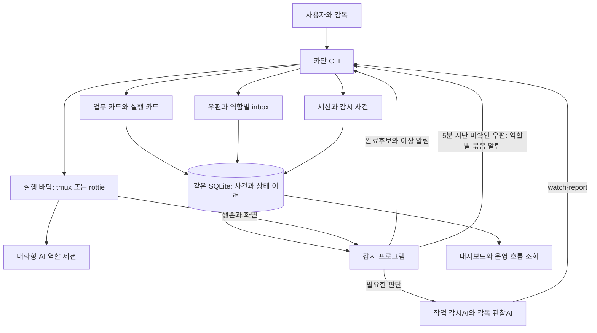
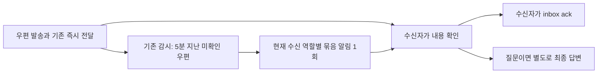

# 카단 구조와 원장 기준

## Why

사용자와 에이전트가 무엇을 맡았는지, 어떤 대화를 확인해야 하는지, 실행이 어디까지 끝났는지를 서로 혼동하지 않고 한 구조에서 확인하게 한다.

이 문서는 구성요소의 관계와 책임을 설명하는 기준 원본이다. 명령·저장 형식은 연결된 주제별 문서를 따른다. 변경 이력·시험 로그는 작업장 기록에 남기고 이 문서는 현재 구조로 갱신한다.

아래는 코드에서 확인한 구조와 동작이다. 실제 운영 DB 전환·감시기 재시작·터미널 수신 여부는 별도 작업 기록에서 확인한다.

## 한눈에 보는 현재 구조

미확인 우편 확인은 기존 감시 순회에 연결한다. UI 조회는 읽음·완료를 대신 기록하지 않는다.

## 각각 무엇을 맡는가

| 개념 | 답하는 질문 | 기준 원본 |
| --- | --- | --- |
| 업무 카드 | 어떤 결과를 누구 책임으로 완성하는가? | 목표·범위·완료 조건·책임 감독·연결 실행을 가진 업무 상태 |
| 실행 카드 | 그 결과를 위해 지금 누구에게 무엇을 맡겼는가? | 구현·검수·수정 등 실행의 범위·담당·진행 상태 |
| 실행 결과·검증 자료 | 무엇을 바꿨고 무엇으로 검증했는가? | 새 실행의 `cards/<저장소>/<실행ID>/result.md`·`evidence/`, 경로·지문·판정은 카드 이력 |
| 공통 실행 사건 원장 | 언제 발령했고 누가 실행을 끝냈는가? | `tasks/events.jsonl`의 plan·dispatch·done |
| 우편 | 누구에게 무슨 말을 했고 읽음·답변은 어떤 상태인가? | `mail/events.jsonl`과 본문 파일 |
| 역할별 우편함(inbox) | 내가 받은 편지·보낸 편지·답할 질문은 무엇인가? | 우편 원장의 역할별 조회. 역할마다 새 DB를 만들지 않음 |
| 시스템 사건 원장 | 어떤 세션이 시작·종료됐고 감시가 무엇을 했는가? | `system/events.jsonl` |
| 실행 바닥 | 어느 터미널에 입력하고 화면을 읽는가? | tmux 또는 rottie의 실제 세션과 PID |

**공통 실행 원장은 실행 카드에 연결되는 사건 이력이다.** 별도의 업무 관리 체계를 하나 더 만드는 것이 아니다. 카드 상태 이력은 약속과 진행을, 공통 사건은 발령·실행 종료를 맡는다. 카드에 연결된 일반 질문도 새 실행은 아니다.

새 실행의 결과 보관·등록과 기존 경로 보존은 [카드 결과 저장 계약](card-center.md#카드-결과와-검증-자료)을 따른다.

카드는 할 일의 계약이고 우편은 전달 수단이다. 작업 지시는 `send --task`로 둘을 연결한다. 질문·답장은 카드 없이 보낼 수 있고, 기존 일에 관한 대화에는 `--work`·`--execution`을 붙인다. 단순 직접 작업까지 카드를 만들지는 않는다.

## 같은 저장소 안의 원장

| 영역 | 저장 스트림 | 범위 |
| --- | --- | --- |
| 작업 | `works/.../events.jsonl`, `cards/.../events.jsonl`, `tasks/events.jsonl` | 기존 업무·카드 상태와 공통 실행 사건 |
| 우편 | `mail/events.jsonl` | send·mail-read·mail-cancel. 질문과 답장은 send의 연결 정보 |
| 시스템 | `system/events.jsonl` | start·stop·alert·watch 등 공통 운영 사건 |
| 기존 전용 상태 | decision·brief·automatic-review 등의 기존 저장 경로 | 원장 분리만으로 합치거나 옮기지 않음 |

SQLite에서는 위 이름이 같은 DB 안의 스트림 주소다. JSONL 호환 방식에서는 파일 경로다. 원장은 뒤에만 추가하며, 과거 `ledger.jsonl` 이력은 그대로 보존한다. 본문은 `mail/<지문>.txt`에 둔다.

우편과 작업을 연결하는 키는 다음과 같다.

- `workKey`: 전체 업무 주소.
- `executionKey`: 관련 실행 카드 주소. 이것만으로 발령을 뜻하지 않는다.
- `taskId`: 실행 발령·DONE을 연결하는 식별자. 짧은 ID와 정식 주소는 기존 [카드 주소 규칙](task-identity.md)을 따른다.
- `mailId`: 개별 우편 ID. `replyTo`는 답장 대상, `dispatchId`는 발령 우편과 실행 사건의 연결이다.
- `completionTaskId`: 자동 결과 우편이 설명하는 실행. 그 우편 자체를 발령으로 만들지 않는다.

`readLedger`는 기존 소비자를 위한 통합 호환 조회다. 발령을 send 형태로 한 번 보여주므로, 새 감시 코드가 모든 send를 터미널 입력이나 새 작업으로 해석하면 안 된다. 저장 원자성·조회 순서·구형 작성자 혼용 제한은 [원장 계약](mail-task-ledgers.md)과 [저장 운영](sqlite-storage.md)을 따른다.

## 서로 대신할 수 없는 상태

| 사실 | 누가 기록하는가 | 뜻하지 않는 것 |
| --- | --- | --- |
| 저장 | CLI와 저장 모듈 | 터미널 전달·읽음 |
| 터미널 전달 | 기존 send와 바닥의 전달 영수증 | AI가 읽음·착수·완료 |
| 읽음 확인(ack) | 내용을 확인한 수신 에이전트가 명시적으로 실행 | 승인·답변 완료·작업 완료 |
| 최종 답변(reply-final) | 현재 수신 책임자의 명시적 답장 | 자동 읽음·사용자 승인·DONE |
| 실행 종료(done) | 마커를 확인한 wait/자동 전달 또는 확인한 감독의 CLI | 검수 합격·전체 업무 완료 |
| 업무 완료(work complete) | 전체 결과와 근거를 확인한 책임 감독 | 개별 DONE만으로 자동 종료 |

`read`, 웹 본문 펼치기, 전송 성공, 답장, DONE에서 읽음을 추정하지 않는다. 읽음은 별도 `mail-read` 사건이다. 질문의 답변 대기는 `waiting → answered` 또는 `waiting → cancelled`이며 ack·중간 답장으로 닫지 않는다.

현재 CLI는 수신자 또는 사용자의 명시적 ack를 허용한다. **에이전트 운영의 기본은 각 수신자가 자기 우편을 확인하는 것**이며, 감시·발신자가 대리 ack하지 않는다. 사용자 수동 처리 예외는 기존 기능이다. `by`·`KADAN_ROLE`은 스스로 밝힌 역할이므로 인증된 신분으로 확대 해석하지 않는다.

## 읽음 확인과 미확인 우편 알림

일반 우편은 기존처럼 즉시 터미널에 넣는다. 원문 보존 `--raw`와 기록용 알림을 제외한 메시지에는 우편 ID와 수신자 `inbox ack` 안내를 붙인다. `--raw`의 원문은 바꾸지 않으며, inbox에서 ID·본문·확인 안내를 조회한다. 저장 전용 `--mailbox`도 `inbox read`의 수신 안내로 확인한다.

- **대상과 유예:** 우편 ID가 있고 읽음 미확인인 편지를 발송 시각부터 5분 유예한 뒤 현재 수신 역할별로 묶는다. 카드 없는 질문도 우편 알림 대상이지만 작업 감시AI 대상이 되는 것은 아니다. 명시적으로 연결된 업무가 보류·완료·취소이면 제외한다. 별도의 판 활성 상태를 추측하지 않는다.
- **전달 전 확인:** 기존 start 원장과 실제 세션 PID가 맞아야 한다. 예약 뒤 읽음·인계·업무 상태와 생존을 다시 확인한다. 사용자·종료 역할을 기동하지 않으며 원문을 재전송하지 않는다.
- **재시작 중복 방지:** 시스템 원장의 `watch-mail-reminder`에 우편 ID와 현재 수신 역할별 예약(`reserved`)·결과(`result`)를 남긴다. 같은 우편·같은 수신 역할은 한 번만 알린다. 예약만 남았거나 실패·전달 불명확이어도 재시작으로 자동 재전송하지 않는다. 후임으로 책임이 이전되면 그 후임에 대한 알림은 별도 한 번 가능하다.
- **사람 입력 보호(2026-09-23):** 알림 예약 전에 tmux 바닥에서 창에 붙은 사람의 마지막 키 입력(`client_activity`)이 10분 안이거나 입력창에 글이 있으면 보류한다. 보류는 붙여넣기 전이므로 예약하지 않고 `watch-mail-held`를 사유별로 한 번만 남긴 뒤 다음 순회에 다시 본다. 확인과 붙여넣기 사이에 입력이 생겨 전송 검사에서 멈춘 경우에는 `result`에 `held:true`를 남기고 예약을 풀어 재시작 뒤에도 다시 시도한다. 입력창 판별은 카드 전송과 같은 기준이다. rottie 바닥은 이 보류를 지원하지 않는다.
- **재귀 제외:** 확인 알림 자체와 기록 전용 자동 완료 우편은 `notificationOnly: true`로 추가 미확인 알림에서 제외한다. 이 필드가 없던 과거 `systemGenerated: task-completion`도 제외한다. 읽음은 자동으로 바꾸지 않으므로 미확인 목록·집계에는 남을 수 있다. 화면은 **기록용 · 추가 알림 없음**을 함께 표시한다.
- **질문 대기:** 읽음·중간 답장으로 답변 대기를 끝내지 않는다. 현재 수신 책임자의 최종 답변 또는 현재 발신 책임자의 취소로 종료한다. 새로운 답변 지연 자동 상신은 없다.

예약·결과는 알림 시도 기록이지 수신자의 열람 증명이 아니다. `ack`는 읽음 사건만 남기며 발신자에게 확인 편지를 보내거나 AI를 추가로 깨우지 않는다.

## 인계 뒤의 우편 책임

시스템 원장에 확정된 `handover/transferred`가 추가되면 그 시점에 존재한 우편별로 수신·발신 책임을 후임에게 이전한다. 전역 역할 이름 치환은 아니다. 준비·인수 수락만으로 이전하지 않는다. 여러 번 인계해도 저장 순서로 책임을 이어가며 동일 인계 ID의 상충하는 참가자는 오류로 처리한다. 이전 뒤 같은 이름으로 새로 받은 독립 우편까지 과거 인계에 소급해 후임에게 넘기지는 않는다. 원본에 연결된 늦은 답장·자동 결과는 원본 발신자의 현재 책임을 이어받는다.

원문의 `role`·`by`와 본문은 보존한다. 조회 결과의 `currentRecipient`·`currentSender`가 현재 책임자다. 받은/보낸 편지·답할 질문·답변 대기 필터와 후임의 읽음·답장·취소 자격은 현재 책임을 따른다. 과거 사건의 읽음·답변 자격은 사건 당시까지 확정된 인계로 판단한다. 화면은 원래 발수신 정보와 현재 책임을 함께 보여주고, 현재 필드가 없는 과거 조회값은 원래 역할을 사용한다.

CLI에서 옛 발신자 주소로 `--reply-to` 답장을 보내도 실제 터미널 목적지는 원본 발신자의 현재 책임자로 정한다. 인계로 목적지가 바뀌면 후임의 start 기록과 PID가 있어야 하며, 실제 생존·PID 대조를 생략하지 않는다. 전달 직전 책임자가 다시 바뀌면 자동으로 다른 세션에 보내지 않고 중단한다. 새 전송 기록의 수신자는 실제 목적지이며 원본 편지의 발수신 정보는 그대로다. `--raw`도 같은 주소·PID 검사를 유지한다.

우편 조회에 인계·완료 근거를 포함하는 방식은 [원장 계약](mail-task-ledgers.md#기록과-조회-계약), 실제 전환 순서는 [인계 안내](handover.md)를 따른다.

## 완료가 흘러가는 현재 경로

수동 실행은 **결과 파일 → 새 실행은 카드에 결과 등록 → 직속 감독에게 완료 통지 1회 → 자기 DONE 마커 → 감독의 근거 확인과 done 기록**이다. watch의 완료후보는 누락을 보완하는 알림이며 그 자체가 done은 아니다. 자동 왕복은 auto-report와 DONE을 프로그램이 확인하고 정상 중간 통지 없이 다음 실행을 연결한다. [발령과 대기](../skills/kadan-conductor/references/dispatch-wait.md)가 절차 원본이다.

SQLite에서 done 사건과 자동 결과 우편은 같은 트랜잭션으로 기록된다. 코어가 원본 발령자를 확인할 수 있는 최초 완료에 결과 우편을 저장한다. 과거 중복 done을 다시 써서 소급 우편을 만들지 않는다. 자동 결과는 원본 발신자의 inbox에 저장되며 터미널을 깨우지 않는다.

자동 결과 우편은 기록용이므로 추가 미확인 알림에서 제외한다. 수동 완료 보고와 자동 왕복의 최종 PASS·예외·블록 경계 통지는 기존 정상 터미널 우편을 유지하고 실행 주소로 연결한다. 이 최종 통지는 수신자의 ack와 미확인 알림 대상이다. 자동 저장이 기존 최종 통지를 대신하지 않으며 검수 PASS와 업무 완료는 계속 별개다.

## 기존 감시와의 경계

| 항목 | 현재 기준 |
| --- | --- |
| 작업 감시 | assigned 카드와 실제 미완료 발령을 기준으로 선별. 우편만으로 작업이 되지 않음 |
| 정상 입력 대기 판단 | 현재 실행의 발령 뒤 보낸 답변 대기 질문을 근거로 판단. 일반 통지·완료 결과·이미 닫힌 질문을 대기로 간주하지 않음 |
| 429 재개 직전 검사 | 저장 전용 mailbox를 터미널 입력 변경에서 제외 |
| 감시AI 문맥 | 최근 우편의 저장/전달·읽음·답변 상태와 현재 책임자를 포함 |
| 기존 주기 깨움 | `watch --wake`의 자가점검과 미확인 우편 묶음 알림을 구별 |
| 읽었지만 미답인 질문 | 질문 대기 유지. 읽음 알림·DONE·업무 완료로 대체하지 않음 |

원장 오류는 대상 0명으로 처리하지 않는다. 새 배달 확인 서비스·별도 우편 감시AI·자동 읽음을 만들지 않는다. 코드와 격리 시험은 운영 반영 증거와 구분한다.

## 구현 근거와 문서 책임

| 범위 | 상세 원본 | 구현 근거 |
| --- | --- | --- |
| 업무와 실행 | [업무 카드와 실행](business-work.md) | [work-store](../src/work-store.mjs), [card-store](../src/card-store.mjs) |
| 원장과 우편 상태 | [작업·우편 원장 계약](mail-task-ledgers.md) | [ledger-domains](../src/ledger-domains.mjs), [mailbox-state](../src/mailbox-state.mjs), [mail-routing](../src/mail-routing.mjs) |
| 명령과 수신자 확인 | [역할 우편함](secretary-mailbox.md) | [mailbox](../src/mailbox.mjs), [cli](../src/cli.mjs), [work-mail](../src/work-mail.mjs), [mail-instructions](../src/mail-instructions.mjs) |
| 감시 | [감시 기준](watch-overview.md) | [watch-scope](../src/watch-scope.mjs), [watch-report](../src/watch-report.mjs), [watch-runner](../src/watch-runner.mjs), [watch-mail](../src/watch-mail.mjs) |
| 완료와 인계 | [자동 왕복](automatic-review.md), [인계](handover.md) | [automatic-review](../src/automatic-review.mjs), [handover](../src/handover.mjs) |
| 저장·전환 | [SQLite 저장 운영](sqlite-storage.md) | [storage](../src/storage.mjs) |

설계 원칙과 잠긴 제약은 [design.md](design.md)에 유지한다. 이 문서는 관계와 개편 경계를, 각 주제 문서는 실행 가능한 명령과 상세 조건을 맡는다. 운영 전환 시 구형 watch/wall/wait 작성자와 신형 작성자를 섞지 않으며, 코드 커밋·시험·실제 운영 반영을 각각 구분한다.
