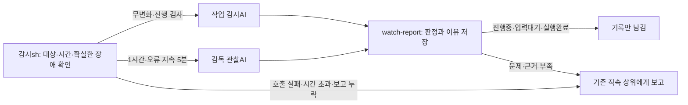

# 카단 라이트 감시 안내

## Why

[kyle]이 작업자의 막힘과 감독의 응답 장애를 구분하고, 같은 화면 때문에 AI를 반복 호출하지 않으면서 필요한 점검은 유지하게 한다.

정책 기준일: **2026-09-09** · [HTML 그림 안내](watch-overview.html) · [문서 목록과 관리 방식](README.md).
이 Markdown이 상세 기준 원본이며 HTML은 같은 기준을 쉽게 보여주는 요약이다.

2026-09-16 후속 구현은 기존 감시 순회에 미확인 우편 확인을 연결한다. **발송 후 5분 유예 → 현재 수신 역할별 묶음 알림 → 우편 ID·수신 역할별 예약/결과 보존**이며, 같은 역할·우편의 재시작 중복 알림을 막는다. 알림 자체와 기록용 자동 결과는 `notificationOnly`로 추가 알림에서 제외한다. 읽음·답변 대기, 생존/PID 검사, 인계와 실패 시 기준은 [구조 기준](architecture.md#읽음-확인과-미확인-우편-알림)을 따른다. 코드 연결은 운영 감시기 재시작이나 실제 터미널 수신 확인을 뜻하지 않는다.

## 작업 감시와 감독 관찰은 다르다

| 구분 | 작업 감시: 감시sh → 작업 감시AI | 감독 관찰AI |
| --- | --- | --- |
| 보는 대상 | 실제 미완료 실행을 맡은 작업자·검수자 | 활성 실행 또는 실제 발령 이력이 있는 열린 업무의 책임 일반감독 |
| 목적 | 필요한 다음 행동이 멈췄거나 진전 없이 반복하는지 확인 | 감독이 응답을 처리하고 맡은 책임을 이어갈 수 있는지 확인 |
| 기본 호출 | 화면 무변화 5분 뒤 첫 판단. 움직이는 running 실행도 30분 진행 검사 | 정상 대기 중이어도 1시간마다 관찰 |
| 같은 상태 재확인 | 같은 실행·관찰 근거면 마지막 호출 시작부터 30분 뒤 | 마지막 실제 관찰 시작부터 1시간 뒤 |
| 새 근거·이른 점검 | 화면·카드 상태·최근 우편 근거가 바뀌면 기존 5분 최소 간격 뒤 후보 재검토. 새 발령·담당 교체는 기존 판단 재사용 안 함 | 최근 연결·압축 오류가 5분 지속되면 먼저 한 번 관찰. 같은 오류의 조기 호출은 반복하지 않음 |
| 호출 제외 | 완료·보류·취소·미발령·유효한 결과 대기. 확인된 같은 실행의 완료 화면도 재호출 생략 | 최상위 슈퍼감독·비활성 업무·실제 실행 없이 관리 카드만 남은 판 |
| 정상 결과 | 기록만 남김 | 정당한 하위 결과 대기는 정상으로 기록만 남김 |
| 문제 결과 | 작업자의 직속 감독에게 이유와 함께 보고 | 해당 감독의 직속 상위에게 이유와 함께 보고 |

**감시sh는 정해진 주기로 계속 돈다. AI가 그때마다 호출되는 것은 아니다.** 확실한 세션 부재·PID 불일치·읽기 오류 등은 sh가 직접 알린다. 화면의 의미 판단이 필요하거나 30분 진행 검사·1시간 감독 관찰 시각이 된 경우 AI 후보를 만든다. 따라서 ‘sh가 모를 때만 AI를 부른다’는 설명은 정기 관찰까지 포함하지 못한다.

두 AI는 목적·대상·호출 이유·보고 이름을 구분하고, 실행기는 공유한다. **강도 max / 호출당 최대 5분 / 전체 동시 실행 1개**다. 대기 중인 감독 관찰을 작업자 후보보다 먼저 꺼내며 이미 진행 중인 AI를 끊고 새 AI를 시작하지 않는다. 큐에 들어간 시각이 아니라 실제 호출을 시작한 시각부터 다음 검사 간격을 센다.

## 한 가지 조회 결과

- `kadan tree`의 `monitoring`, `GET /api/cards`의 `center.monitoring`, 판의 감시 영역은 같은 `watch-overview.mjs` 계산을 사용한다.
- 원본은 중앙 실행·업무 카드, 직속 관계 JSON, 현재 KADAN_HOME의 실행 원장, OS 프로세스다. 실제 감시·AI 보고·대시보드가 `buildWatchScope`와 `buildSupervisorScope`를 함께 사용한다. 대시보드는 읽기 전용 조회 결과이며 별도의 설정 원본이 아니다. `checkedAt`은 조회 시각이다.
- 카단의 감시기는 전역 프로세스 하나다. 판마다 감시기를 새로 띄우지 않고, 이 감시기의 판별 대상과 상신 경로를 보여준다.

## 확인하는 것

| 항목 | 근거 | 읽는 법 |
| --- | --- | --- |
| 감시기 생존 | 정확한 kadan-watch 프로세스 이름, PID, 시작 시각 | 실행 중/없음/중복/조회 모름 |
| 설정 반영 | 같은 PID의 시작 이후 hierarchy-loaded 기록, 현재 관계 파일의 SHA-256 | 지문 일치일 때만 현재 관계가 반영됐다고 표시 |
| 판별 대상 | 실제 미완료 작업자와 활성 책임이 있는 일반감독 | 작업자 감시와 감독의 1시간 응답 점검을 구분해 표시 |
| 상신 경로 | 검증된 직속 관계와 현재 역할 생존/PID | 직속 상위가 없으면 같은 사슬의 다음 상위, 최종 @user |
| 최근 경보 | 역할/상신 대상에 해당하는 alert 원장 | 전송 성공/실패 기록. 수신자가 처리했다는 뜻은 아님 |
| 감시 주기 정상 여부 | 감시기가 첫 주기와 5분마다 남기는 `watch-cycle` 원장(PID·관계 파일 경로·AI 판정 유무·프로필·대상 수) | 현재 PID의 마지막 기록이 15분 안이면 정상, 넘으면 지연. 기록이 없으면 모름(구버전 감시기이거나 기록 실패)이며 0이나 정상으로 꾸미지 않음 |
| 최근 24시간 공백 | 같은 `watch-cycle` 기록 사이 15분 넘게 빈 구간 | 첫 기록 이후만 센다. 감시기가 죽어 있던 시간이 여기에 드러남 |

### 한 줄 판정 (2026-09-12)

첫 화면 맨 위에는 위 항목을 합친 한 줄만 둔다. `monitoring.verdict`(`level`, `text`, `hints`)이 같은 값이다.

| 판정 | 뜻 |
|---|---|
| 감시 정상 · 관계 파일 반영 · AI 판정 켜짐 · 마지막 주기 N분 전 | 프로세스 1개, 관계 파일 지문 일치, `--judge-cmd` 있음, 주기 기록 15분 안 |
| 감시 설정 빠짐 · 관계 파일 없음 / AI 판정 꺼짐 | 감시기는 살아 있지만 `--hierarchy`·`--judge-cmd` 없이 떠 있음. 상신 경로와 AI 판정이 동작하지 않으므로 정식 명령으로 다시 띄운다 |
| 감시 주기 지연 · 마지막 주기 N분 전 | 프로세스는 살아 있는데 15분 넘게 주기 기록이 없음 |
| 감시기 설정 확인 불가 · 주기 기록 없음 | 주기 기록을 남기지 않는 구버전 감시기이거나 기록 실패. 정상으로 올리지 않음 |
| 감시기 없음 · 마지막 주기 HH:MM (N시간 전) | 프로세스 없음. 마지막 기록 시각으로 공백을 알 수 있음 |
| 감시기 중복 실행 N개 | 하나만 남기고 종료해야 함 |

공백이 15분 이상이면 어느 판정이든 뒤에 `최근 24시간 공백 N시간 M분 (HH:MM~HH:MM)`을 붙인다.

### 정식 명령 프로필 (2026-09-12)

맨 `kadan watch`로 다시 띄우면서 관계 파일과 AI 판정을 잃은 사고를 막기 위해 정식 명령을 `$KADAN_HOME/watch-profile.json` 한 파일에 둔다.

```json
{"flags":{"route":["제품=제품-감독"],"super":"제품-슈퍼감독","hierarchy":"/절대경로/관계.json","start-report-after":5,"stall-after":5,"judge-cooldown":5,"judge-cmd":"bash /절대경로/scripts/watch-judge.sh"},"env":{"KADAN_JUDGE_MODEL":"..."}}
```

- `kadan watch --profile <파일>`로 읽는다. 직접 준 옵션이 우선이고 프로필은 빈 자리만 채운다. `env`는 비어 있는 환경 변수만 채운다. 적용한 옵션 이름을 시작 출력에 남긴다.
- 옵션이 하나도 없는 `kadan watch`는 기본 경로의 프로필이 있으면 자동으로 적용한다. 옵션을 하나라도 직접 주면 자동 적용하지 않고 안내만 한다.
- `--hierarchy`나 `--judge-cmd`가 끝내 없으면 표준 오류에 경고를 남기고 그대로 시작한다. 시작을 막지는 않는다.
- `watch-cycle` 기록에 프로필 경로가 남으므로 대시보드가 어느 명령으로 떠 있는지 답할 수 있다. 프로필은 새 옵션이나 권한을 만들지 않는다.

`@user`는 [kyle]에게 OS 알림을 시도하는 경로다. OS 알림이 실제로 보였거나 사용자가 읽었다는 뜻은 아니다. ‘현재 상신 대상’도 조회 시점의 예상 수신자이며 실제 경보의 전송 결과와 구분한다.

## 확인이 필요한 경우

- 관계 파일 변경 후 감시기의 새 지문 기록이 없으면 반영 확인 전이다. 이전 파일 내용은 추측해 복원하지 않는다.
- 미등록 역할은 기존 route/이름/공통 상위 규칙이 적용될 수 있다. 따라서 ‘직속 관계 미등록’이지 즉시 ‘감시 없음’이 아니다. 해당 실행 설정을 추가 확인한다.
- PID가 같아도 프로세스 시작보다 오래된 관계 기록이면 재사용 가능성이 있어 인정하지 않는다.
- 중복 감시, 프로세스 조회 실패, 파일 읽기 실패, 원장 손상은 정상으로 표시하지 않는다.
- 카드·원장·현재 관계를 확인한 뒤 실제 대상이 없는 판만 ‘감시 대상 없음’이다. ready·미배정·옛 plan·미등록 실행·관리 카드만으로 세션 감시를 시작하지 않는다. 조회 실패나 현재 감시기의 관계 반영 미확인은 대상 수 `null`(모름)이며 0으로 표시하지 않는다.

## 비서·슈퍼감독 사용

현황 질문을 받거나 판을 점검하는 시점에 `kadan tree`를 한 번 읽는다. `monitoring.process`, `configuration`, `cycle`, `boards`를 구분해 보고하고, `missingRoles`와 상신 사슬을 참고한다. 조회 결과의 설정 확인은 주기 정상·실제 알림 전송·업무 완료를 대신하지 않는다.

비서는 이상을 기존 슈퍼감독에게 전달하는 절차를 따른다. 조회 기능은 감시를 재시작하거나, 관계 파일을 수정하거나, 우편을 발송하지 않는다. 조회 화면을 유지하려고 AI를 주기적으로 깨우지 않는다.

역할 목록에는 실제 작업자와 활성 일반감독만 넣고, 최상위 슈퍼감독은 수신 경로에만 표시한다. 기존 정렬 함수를 사용하며 관계 미확인 역할은 마지막이다. `hierarchyDepth`는 화면 들여쓰기 깊이이며 CLI/API도 같은 순서를 제공한다. 이름 접두사로 감독 여부나 소속을 추정하지 않는다.

## 감시체계의 책임



감시sh는 AI의 일반 답변(stdout)을 판정하지 않는다. 감시ai가 전용 보고 명령을 실행하면 그 명령이 기록·중복 방지·상신을 처리한다. 작업 재개·담당 변경·완료 확정은 감독의 책임이다.

## 작업 감시AI 호출 시점

| 검사 | 시점 | 대상 | 처리 |
|---|---|---|---|
| 화면 무변화 | `--stall-after` 기본5분과 `--stall` 횟수 충족 | 실제 미완료 실행을 맡은 작업자·검수자 | 작업 감시AI가 화면을 판단하고 보고 |
| 문제 후 재확인 | 기존 AI 경보가 남아 있고 다음 호출 시각 도달 | 여전히 책임이 있는 같은 대상 | 정상 여부를 다시 AI가 판단. 화면 변화만으로 정상 확정하지 않음 |
| 진행 조정 | running 실행 카드의 이전·현재 화면을 30분 간격으로 비교 | 선별된 작업자 중 결과대기·완료·보류 제외, PID 일치 | 반복 실패·목표 밖 범위 확장 여부를 AI가 판단 |

같은 실행·같은 관찰 근거의 재호출은 역할별 **30분** 간격이다. 화면·세션/PID·현재 카드 상태와 범위·최근 우편/읽음/완료 기록을 함께 비교한다. 새 근거가 있으면 기존 `--judge-cooldown` 기본5분 간격 뒤 후보를 재검토한다. 화면 변화 자체를 정체 해소나 정상 판정으로 바꾸지는 않는다. 새 발령·담당 교체로 실행 책임이 바뀌면 이전 판단은 재사용하지 않는다.

정체 판단과 진행 검사는 같은 역할의 마지막 실제 AI 호출 시각을 공유한다. 정체 판단을 방금 했는데 별도의 30분 진행 검사 때문에 즉시 다시 호출하지 않는다. 재시작 시 화면 관찰은 새로 시작하지만, 원장의 호출 시각·실행 책임·관찰 지문이 일치하면 기존 30분 간격을 유지한다. 지문 없는 과거 기록은 추측하지 않는다. 실패한 호출도 같은 근거로 5분마다 다시 실행하지 않으며 호출 장애 경보는 유지한다.

작업 감시AI와 감독 관찰AI의 호출 상한은 실행기 시작부터 판단·보고까지 **5분**이다. 큐 대기 시간은 호출 상한에 포함하지 않는다.

AI가 판단하는 동안에도 감시sh는 설정된 주기로 화면·세션·보고 누락을 계속 점검한다. AI는 동시에1개만 실행하며 대기 후보는 역할별로 합친다. 감독 관찰을 우선하고 같은 종류 안에서는 대기 순서를 유지한다. 시작 직전에 현재 담당과 최신 화면을 확인하므로 완료·보류·교대된 옛 후보는 호출하지 않는다.

보고와 필요한 전달이 원장에 확정되면 해당 호출 폴더의 `report-complete` 신호를 남긴다. 실행기는 실제 원장 접수를 대조한 뒤 해당 AI 호출만 종료하고 최종 인사 답변을 기다리지 않는다. 이 파일은 빠른 종료를 위한 보조 신호이며 원장이나 새 승인 절차가 아니다. 시간 초과·감시 종료·대상 제외 때도 해당 호출의 자식 프로세스만 정리한다.

`--judge-cmd 'bash /절대경로/scripts/watch-judge.sh'`를 연결한다. 모델은 `command-code/deepseek-deepseek-v4.1-flash`, 강도 max다 (2026-09-10 [kyle] 결정 — deepseek 신모델 출시로 승급). 감시기를 띄울 때 `KADAN_JUDGE_MODEL`로 지정한다. 스크립트에 기본 모델은 없으며 미지정이면 즉시 종료한다(2026-09-12 공개 준비로 fallback 제거). 다른 모델로 자동 전환하지 않는다. 명령이 없으면 기존 규칙 후보만 보고한다. `watch-judge.sh`를 단독 판정기로 호출하는 대신 `kadan watch`가 호출 폴더와 보고 명령을 제공한다.

## 감시ai의 보고 명령

```text
kadan watch-report <호출ID> --verdict <판정> --reason "판단 이유"
```

| 판정 | 기록과 알림 |
|---|---|
| 진행중 / 입력대기 / 실행완료 | 기록만 남긴다. 기존 AI 경보도 우편 없이 닫는다 |
| 정체 | 멈춘 근거와 함께 담당 감독에게 확인 요청 |
| 응답장애 | 연결·압축 실패 등의 지속 근거로 상위에게 응답 장애 의심 보고 |
| 조정 | 반복 실패·범위 확대 근거로 조정 요청. 연속2회는 RED, 이후 같은 상태 재보고 없음 |
| 모름 | AI가 판단할 근거가 부족하다는 이유를 보고. 호출 실패와 구분 |

AI가 수신자를 임의로 지정하지 않는다. 명령이 기존 hierarchy → route/판 감독 → super 경로를 적용하며, 계층의 최상위는 `@user`다. 받는 세션 생존/PID 검사는 기존 `send`와 같다. 확실한 미전송만 기존 상신 경로로 올리고, 모호한 전송은 재시도하지 않는다. `--user-notify`의 RED 사용자 알림도 유지한다.

같은 호출은 한 번만 처리하고 같은 대상·실행 세대의 같은 문제는 등급/판정이 바뀔 때만 다시 알린다. 정상 판정 뒤 재발은 새로운 문제로 보고한다. 완료·보류·재배정·세션 교체·기한 종료 뒤의 늦은 보고는 보내지 않는다. 과거 이력은 지우지 않는다.

## 감시sh가 직접 알리는 것

선별된 작업자의 세션 부재/PID 변화, 명확한 접속·한도·설정 오류, DONE 후보, 읽기 오류는 기존 규칙으로 알린다. `--start-report-after` 기본5분 이후 유효한 시작/결과대기·완료가 없으면 시작 보고 누락을 알린다. 이미 시작한 역할에 정기 보고를 요구하지 않는다. 일반감독은 아래 별도의 응답 점검 대상이며, 최상위 슈퍼감독은 정기 점검 대상이 아니다. 관계·원장 오류는 작업자 대상 유무와 별도로 검사하고, 상신 수신자의 생존/PID 확인은 유지한다. 컴퓨터 자원 수치는 아래 대시보드 확인 대상으로 분리한다.

시작 보고 누락의 잡음 규칙(2026-09-12):

- 새 경보는 발령 후 유예 시간이 지났고 **그 세션 화면이 유예 시간만큼 멈춰 있을 때만** 만든다. 발령 후 경과 시간만으로는 알리지 않는다. 작업 중인 검수자에게 시작 보고가 없다고 알리고 46초 뒤 완료가 온 오경보가 근거다. 감시기 재시작 직후는 화면 관찰이 다시 쌓일 때까지 새 경보를 만들지 않는다.
- 같은 발령(카드·담당·전달 시각)의 경보가 한 번 울리고 해소(감시제외 포함)됐으면 다시 만들지 않는다. 새 발령은 새 경보다. 아직 해소되지 않은 경보는 재시작 시 원장에서 복원되며 화면 관찰과 무관하게 조건이 남아 있는 동안 유지한다.
- 관계 파일 없이 뜬 감시기는 감독의 자기 배정 카드를 작업자로 오인해 며칠 지난 발령에 시작 보고 누락을 보낸다. 이는 위 규칙이 아니라 정식 명령 프로필로 막는다.

AI 호출에는 다음 장애를 구분하여 `감시AI 점검 필요`로 알린다.

| reason | 뜻 |
|---|---|
| timeout | 보고 없이 제한시간 초과 |
| call-failed | 보고 없이 실행 실패 |
| report-missing | 실행은 끝났지만 보고 명령을 실행하지 않음 |
| report-incomplete | 판정은 기록됐으나 전달 처리 기록 미완료 |
| report-error | 보고 준비·실행·저장 경로 오류 |

AI가 정상 보고를 마쳤으면 마지막 대화 응답의 호칭·문구·출력 형식은 무관하다. 보고 후 실행이 실패한 경우도 실행 종료코드는 남기되 같은 보고를 재전송하지 않는다. 호출 오류가 사라졌을 때도 해제 우편은 보내지 않는다.

## 기록과 증거

원장은 `watch-ai-request`(호출 대상), `watch-ai-report`(판정), `watch-ai-delivery`(전송), `watch-ai-call`(실행 결과), `watch-ai-retired`(책임 종료)를 각각 남긴다. 대시보드의 기존 `alert`와 `send` 기록도 유지한다. 저장 잠금 안에서 중복 여부를 확정하고 실제 외부 전송은 잠금 밖에서 한다.

기존 `source` 값은 유지한다. `stall`·`progress`는 작업 감시AI, `supervisor-health`는 감독 관찰AI다. 우편·CLI 로그·화면의 사건 기록도 이 이름으로 구분한다. 종류를 알 수 없는 옛 기록은 ‘감시AI’로만 표시하며 원문을 고치지 않는다. 판 감시 영역은 **현재 그 판의 감시 대상 역할**에 대해 최근 24시간 호출·보고 완료·시간 초과·기타 오류를 두 AI별로 보여준다. 판 전체의 과거 비용 통계는 아니다. 조회에 실패하면 0 대신 모름을 표시한다.

### HTTP 499와 보고 완료를 구분하기

설치된 OpenCodex의 `src/server/responses/core.ts`는 응답 완료 전에 클라이언트 연결이 끝난 경우 499(`client_cancelled`)를 기록한다. 보고 접수 뒤 카단이 해당 AI 호출을 종료하는 정상 경로에서도 마지막 응답 요청이 취소될 수 있다. **499 한 줄만으로 카단의 보고 실패나 시간 초과라고 판정하지 않는다.**

- `watch-ai-call.reason=reported`: 보고와 필요한 전달 기록이 끝남. 마지막 일반 답변(stdout)이 비어 있어도 보고 완료다.
- `reason=timeout`: 보고 접수 없이 호출 상한을 넘김. 변경 후 상한은 300초다.
- 그 밖의 실패: `reason`과 호출 폴더의 진단을 확인한다. 499와 특정 카단 호출의 연결은 요청 ID·시각을 대조해야 한다.

5분으로 늘리면 3분을 넘겨 보고하는 AI를 기다릴 수 있다. 보고 후 의도적인 연결 종료 등 모든 499를 없애는 변경은 아니다. 보고 접수와 종료 이유는 [감시 호출 구현](../src/watch-ai.mjs)에서 구분한다.

관찰 원문·이유·응답·진단은 `$KADAN_HOME/watch-ai/<호출ID>/`에 둔다. 폴더0700·파일0600이며 자동 삭제하지 않는다. 원장에는 모델·지문·종료코드·경과시간·증거 경로를 남기고 임의 답변 원문을 복제하지 않는다. 보고 문구의 이유는 우편 본문에 포함하므로 비밀값·원문 로그를 넣지 않는다. AI 쓰기 범위는 호출 폴더와 카단 데이터 폴더이며 제품 작업 폴더를 추가하지 않는다. 이 명령은 로컬 신뢰 환경의 도구이며 사용자 인증 장치는 아니다.

## 실제 화면 감시 대상

화면 읽기 전에 중앙 카드와 실행 원장에서 활성 assigned 카드의 미완료 실제 send를 찾는다. 관리 카드(`workType=coordination`)와 실제 보고 관계(`parents`)에서 하위 역할을 관리하는 상위는 제외한다. 현재 start 기록에는 별도 직무 종류 필드가 없으므로 이름이나 없는 필드를 추측하지 않는다. 과거 workType 필드가 없는 카드는 기존 실행 카드 구분을 유지하되 실제 send와 활성 assigned 조건을 모두 요구한다.

같은 담당·실행의 send 뒤 done이 기록되면 중앙 카드가 assigned로 남아 있어도 제외한다. `activity=waiting`도 `activityRole`이 현재 담당이고 유효한 `activityAt`이 현재 send 시각 이후이면 제외한다. 이후 실제 새 send가 오면 옛 waiting은 적용하지 않는다. 다른 미완료 assigned 실행이 있으면 해당 작업자는 계속 포함한다. mailbox 우편, ready 계획, 미등록 옛 실행, 감독·슈퍼감독의 start만으로는 포함하지 않는다. 입력대기 판정은 정상 기록만 남기고, 종료·유효 waiting·감독 제외에 따른 늦은 보고와 이전 경보는 기존 감시 제외 경로로 조용히 닫는다. 전체 창 생존 목록은 전달 경로 확인에 남긴다. 카드/원장을 못 읽으면 대상과 경보를 정상으로 추정해 지우지 않는다. JSONL의 `{broken: ...}` 반환도 선별 함수 입구에서 오류로 처리한다.

대상 변경은 `watch-scope`에 남는다. 감시제외와 AI 정상 판정은 회복 편지를 보내지 않는다. 기존 기계 경보의 해제는 같은 수신자에게 한 번 전달되며 작업 완료 보증은 아니다.

구현 근거: [직접 보고](../src/watch-report.mjs), [작업 감시 대상](../src/watch-scope.mjs), [감독의 활성 책임](../src/watch-supervisor-health.mjs). 예전 낱말 응답 함수는 과거 API 호환 시험용으로 남아 있으며 실제 `kadan watch`는 사용하지 않는다.

## 감독 관찰AI의 응답 점검 (2026-09-09)

- 작업자 화면 감시와 감독 응답 점검은 다른 시간 기준을 쓴다. 활성 실행(정당한 결과 대기 포함)의 실제 상위 일반감독, 또는 실제 발령 이력이 있는 열린 업무의 책임 일반감독을 고른다. 최상위 슈퍼감독, 관리 카드만 남은 판, 보류·완료·취소 업무는 제외한다. 실행은 끝났지만 열린 업무의 최종 확인이 남은 감독은 포함한다.
- 기본 1시간에 한 번 확인한다. 최근 화면의 연결 재시도·SSE 시간 초과·문맥 압축 실패가 5분 유지되면 먼저 한 번 확인한다. 같은 오류가 유지되는 동안 조기 호출은 반복하지 않으며 이후 정기 점검에서 다시 판단한다. 한 주기 신규 감독 1명씩 처리하고 대기열의 실제 호출 시작 시각부터 다음 1시간을 센다.
- 감시ai에는 이전/현재 화면, 세션 생존/PID, 맡은 실행과 책임, 최근 우편·읽음·완료 기록을 함께 제공한다. 오래된 오류 한 줄·정상 결과 대기·우편 도착만으로 장애나 처리 완료를 단정하지 않는다.
- 새 보고 규약(protocol 2)은 `실행완료`와 `응답장애`를 구분한다. `죽음`은 새 AI 보고에서 거절한다. 실제 세션 부재는 감시sh가 알리고 과거 AI 판정은 보존한다. AI 응답 본문을 sh가 다시 판정하지 않는다.
- 실행완료는 관찰 기록이며 중앙 카드·원장의 done이나 업무 완료를 대신하지 않는다. 같은 실행 세대·같은 완료 화면은 작업자 AI를 다시 호출하지 않는다. 감독 정기 점검은 이 생략 규칙을 적용하지 않는다.
- 점검 대상은 `watch-scope.supervisorSessions`, 호출/판정/전송은 기존 `watch-ai-*` 원장에 남는다. 대시보드·`kadan tree`도 동일 선별 함수를 사용하고 감독 점검 주기와 마지막 판정 시각을 표시한다.

## 자원 수치 확인

메모리·스왑·CPU 수치는 대시보드와 CLI 조회에서 확인한다. watch는 자원 경고나 해제 우편·사용자 알림을 만들지 않으며, 자원 값 때문에 AI를 깨우지 않는다. 과거 자원 경보 이력은 보존한다.

일반감독은 작업자를 추가하거나 무거운 작업을 발령할 때 현재 수치와 진행 중인 작업을 보고 실행 규모를 정한다. 색상이나 수치 하나를 자동 중단·상신 조건으로 삼지 않는다. 확인을 위해 AI를 주기적으로 깨우거나 작은 작업마다 새 승인·진행보고를 요구하지 않는다. 실제 작업 오류와 응답 장애 감시는 유지한다.

현재 조회 수치를 시간별로 쌓는 기록이나 기록 탭은 이번 변경에 포함하지 않는다.

구현 근거: [감독 응답 점검](../src/watch-supervisor-health.mjs).

## 일시적 429 제한 재개 (2026-09-10)

사용자 승인 예외로 실행기 자체 재시도가 끝난 작업자에 1/2/3분 최대3회 재개를 예약한다. 대상·보류·횟수 보존은 [429 재개 안내](rate-limit-retry.md)를 따른다. 다른 오류의 자동 재시작 정책은 변경하지 않는다.

### 완료후보 경보 유예

DONE 후보를 처음 관측한 뒤 기본 15분 동안 완료 확정을 기다린다. `--completion-grace <분>` 또는 감시 프로필의 `flags["completion-grace"]`로 조절하며, 0은 즉시 확인 알림이다. 매 감시 주기에 tasks를 포함한 통합 원장을 읽고 executionKey와 카드 주소를 대조한다. 유예 안에 done이 확인되면 경보와 해소 우편 모두 보내지 않는다. 유예가 지나도 미확정이면 감독에게 한 번 알린다. 화면에서 마커가 사라져도 후보는 유지하지만 감시 대상 제외·세션 재시작 때는 폐기한다. 감시기 자체를 재시작하면 미발송 후보의 유예는 다시 시작한다. 큐대기·시작보고누락·정체 등 다른 경보의 시간 기준은 바뀌지 않는다.

## 입력 큐 배너 자동 재개 (2026-09-21)

작업자 화면에 명시 큐 배너 `Press Enter to send queued messages now`가 보이면 AI 판정과 무관하게 결정식 규칙으로 먼저 처리한다. AI가 `정상 대기`로 판정해도 이 명시 신호를 덮어쓰지 못한다.

다음 조건이 모두 맞을 때만 같은 tmux 세션에 **본문 없는 빈 Enter를 정확히 1회** 보낸다.

- 역할에 미완료 `assigned` 카드가 하나뿐이고 activity가 `running`이다.
- 역할 프로세스가 살아 있고 기대 PID와 일치한다.
- pane이 copy mode(기록보기)가 아니다.
- 배너 뒤 화면에 완료 마커·진행 표시·승인 질문·입력창 미완성 텍스트가 없다.
- 같은 화면 지문에 아직 자동 Enter를 보내지 않았다.

전송 직전에 카드·담당·PID·화면 지문을 다시 읽어 바뀌었으면 보내지 않는다. Enter 뒤 짧고 제한된 확인에서 배너 소거·진행 전환만 `queue-resume` 사건으로 기록한다. `keyDelivery=sent`와 `inputAcceptance=unconfirmed`를 구분해 남기며 키 전송을 작업 접수·성공으로 확대하지 않는다.

전환이 없거나 PID 불일치·copy mode·죽은 pane·카드 완료·일반 빈 프롬프트·부분 입력·승인 질문이면 Enter를 재시도하지 않고 이유가 구분된 `입력큐` 경보를 감독에게 한 번만 보낸다. 화면 지문이나 카드 세대가 바뀐 것만 새 사건으로 본다.

이 규칙은 명시 큐 배너에만 적용한다. 일반 입력 프롬프트·승인 화면·임의 텍스트에는 키를 보내지 않는다. 감시 판정 AI의 timeout은 작업자 응답 장애와 분리해 `감시 판정 AI 시간 초과 — 작업 상태 미판정`으로 알린다.

## 순회 시간과 경로 근거

기존 5분 간격 `watch-cycle`에 `timing`을 함께 기록한다. 원장 조회(`ledgerMs`), 관계·카드·대상 준비(`prepareMs`), 최초 화면 수집(`screenMs`), 이후 판단·전달(`otherMs`), 전체(`totalMs`)이며 단위는 ms다. 화면 대상 수는 최초 수집에서 살아 있던 세션 수다. 전체 시간은 주기 기록 자체와 다음 순회까지의 대기를 제외하고, 비동기 AI 완료 대기 시간을 합산하지 않는다. 시간은 단조 시계로 재고 감시 주기·대상·재시도 규칙은 바꾸지 않는다. 옛 기록에 계측값이 없으면 모름이다.

새 감시 경보는 선택 당시 수신자·선택 기준·생존 세션이 없어 건너뛴 상위를 `route`로 보존한다. 대시보드는 현재 예상 경로와 실제 경보의 경로를 구분해서 보여준다. 명시한 관계, 판별 지정 경로, 역할 이름, 최상위 감독 순서와 기존 우편 인계 규칙은 유지한다. 기록이 없는 옛 경보의 경로를 소급 추정하지 않는다.
